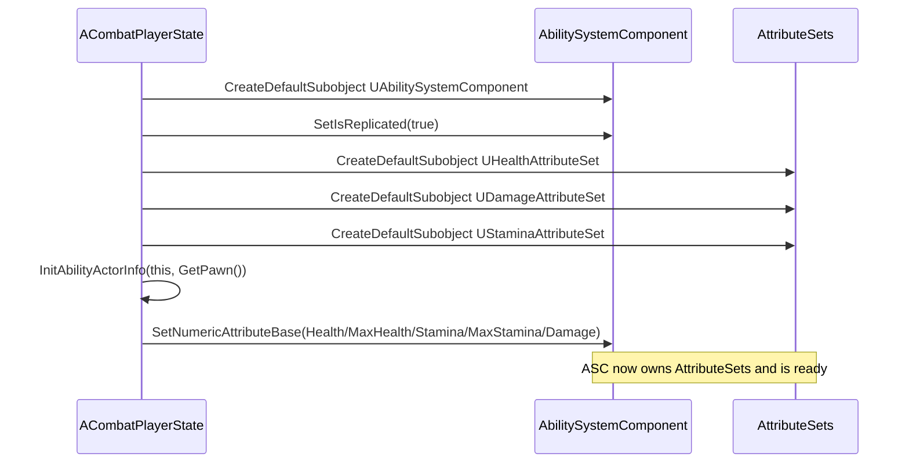
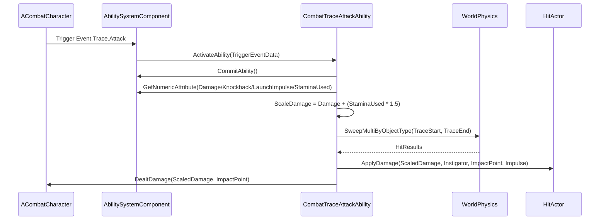
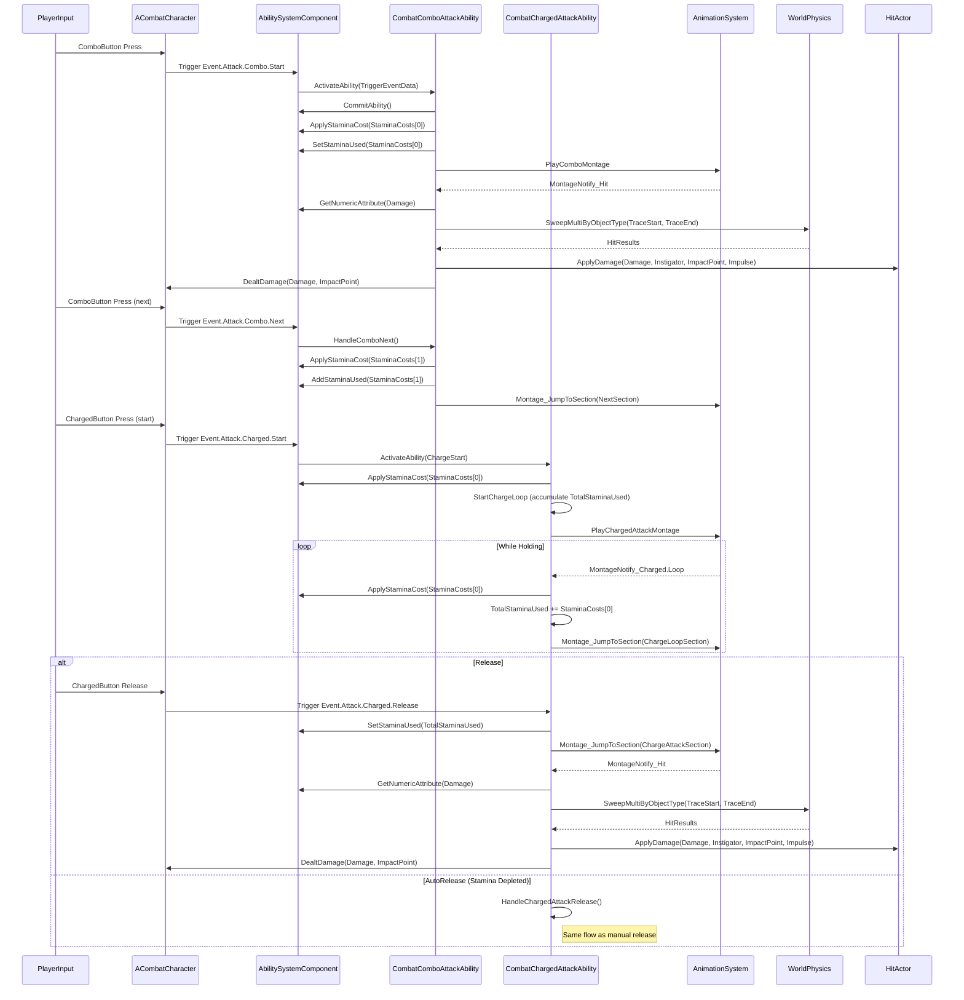
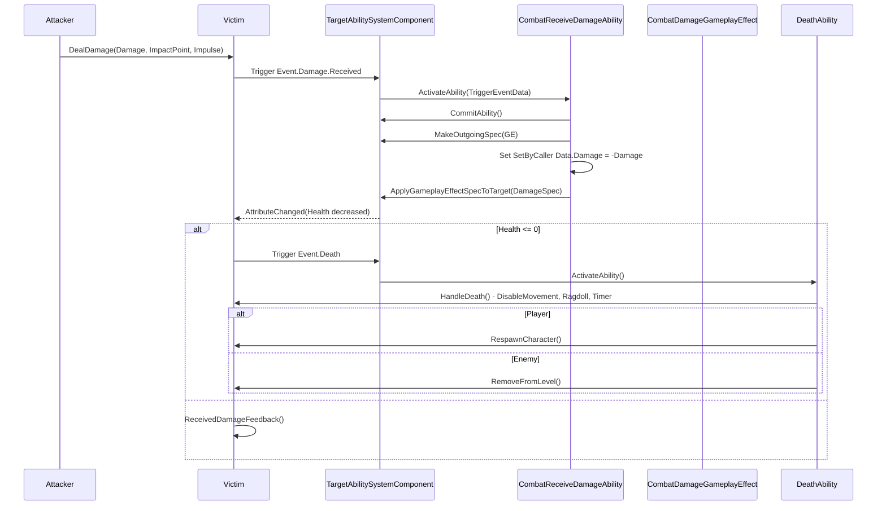
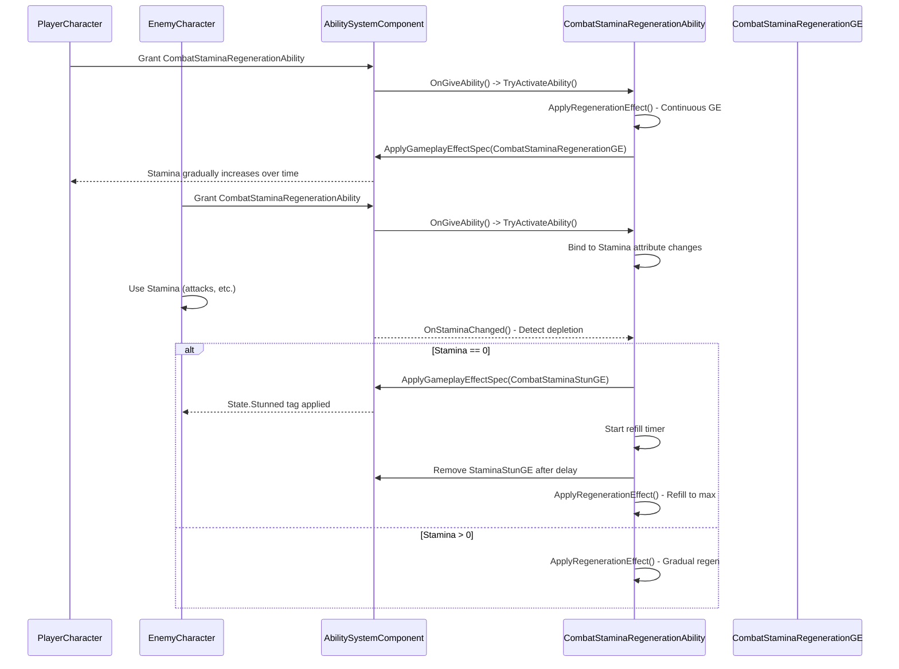

# GAS Sequence Walkthrough

This short walkthrough contains sequence diagrams that show key runtime flows for the Gameplay Ability System (GAS) usage in the `Variant_Combat` codebase.

Note: diagrams use Mermaid syntax. View with a Markdown preview that supports Mermaid (e.g., VS Code with a Mermaid extension).

## 1) AbilitySystemComponent initialization

When a PlayerState is created, the ASC is constructed and initialized so abilities and attributes are available at runtime.

## 2) Attack ability activation & trace flow (CombatTraceAttackAbility)

This diagram shows a high-level flow where an ability is triggered by an input or gameplay event, commits, reads attributes, performs a trace, and applies damage via interfaces or GameplayEffects.

## 3) Combo and Charged attack flow

This diagram shows the input and ability flow for combo attacks (quick chained presses) and charged attacks (press and hold -> release to launch).

## 4) Receive damage flow & GameplayEffect application (CombatReceiveDamageAbility)

This flow shows a damage event causing the receive-damage ability to apply a GameplayEffect (SetByCaller) to update health and trigger death logic.

## 5) Stamina regeneration flow (CombatStaminaRegenerationAbility)

This flow shows how stamina regenerates passively for players and reactively for enemies.

## How to use these diagrams

-   Open `docs/GAS_SEQUENCE.md` in VS Code and preview with Mermaid support to see the diagrams.
-   Use these as a reference when adding new abilities, attributes, or GameplayEffects: follow the ASC init pattern and the ability commit/apply flow.
-   Key concepts: Stamina costs scale damage, momentum preservation during attacks, enemy notification system, and proper cleanup with GrantedHandles.
